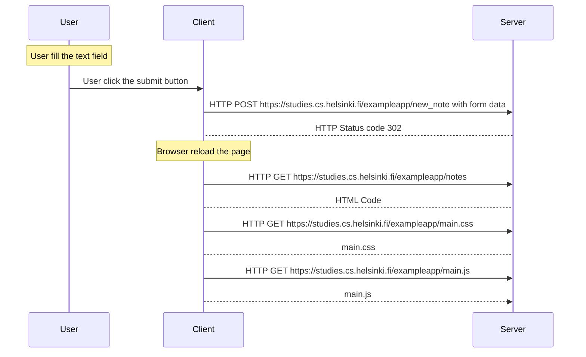

```mermaid
sequenceDiagram
    participant User
    participant Client
    participant Server
    
    Note over User : User fill the text field
    User ->> Client : User click the submit button
    Client ->> Server : HTTP POST https://studies.cs.helsinki.fi/exampleapp/new_note with form data
    Server --> Client : HTTP Status code 302
    Note over Client : Browser reload the page
    Client ->> Server : HTTP GET https://studies.cs.helsinki.fi/exampleapp/notes
    Client --> Server : HTML Code
    Client ->> Server : HTTP GET https://studies.cs.helsinki.fi/exampleapp/main.css
    Client --> Server : main.css
    Client ->> Server : HTTP GET https://studies.cs.helsinki.fi/exampleapp/main.js
    Client -->> Server : main.js
    
```
