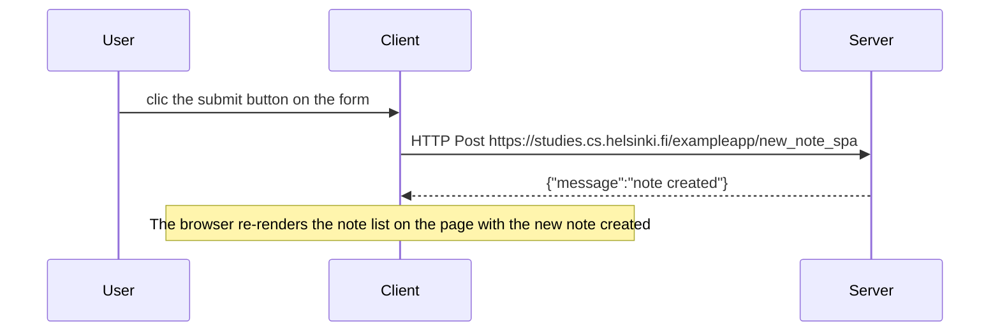

```mermaid
sequenceDiagram
    participant User
    participant Client
    participant Server
    User ->> Client: clic the submit button on the form
    Client->>Server: HTTP Post https://studies.cs.helsinki.fi/exampleapp/new_note_spa
    Server-->>Client: {"message":"note created"}
    Note over Client: The browser re-renders the note list on the page with the new note created
```
