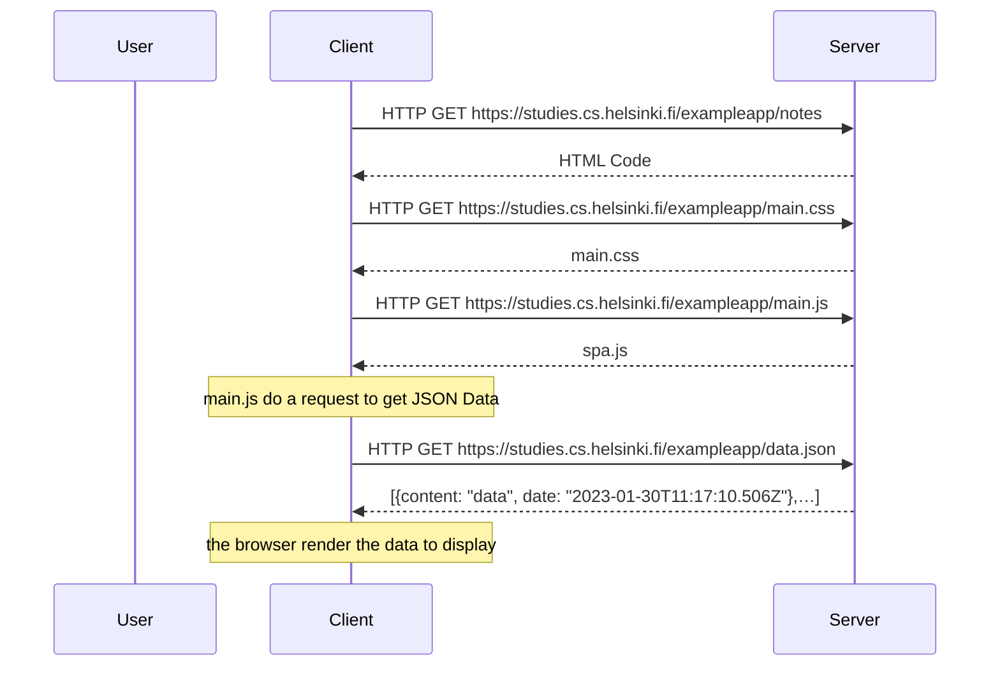

```mermaid
sequenceDiagram
    participant User
    participant Client
    participant Server
   
    Client ->> Server : HTTP GET https://studies.cs.helsinki.fi/exampleapp/notes
    Server -->> Client  : HTML Code
    Client ->> Server : HTTP GET https://studies.cs.helsinki.fi/exampleapp/main.css
    Server -->> Client : main.css
    Client ->> Server : HTTP GET https://studies.cs.helsinki.fi/exampleapp/main.js
    Server -->> Client : spa.js
    note over Client : main.js do a request to get JSON Data
    Client ->> Server : HTTP GET https://studies.cs.helsinki.fi/exampleapp/data.json
    Server -->> Client : [{content: "data", date: "2023-01-30T11:17:10.506Z"},…]
    note over Client : the browser render the data to display

```
